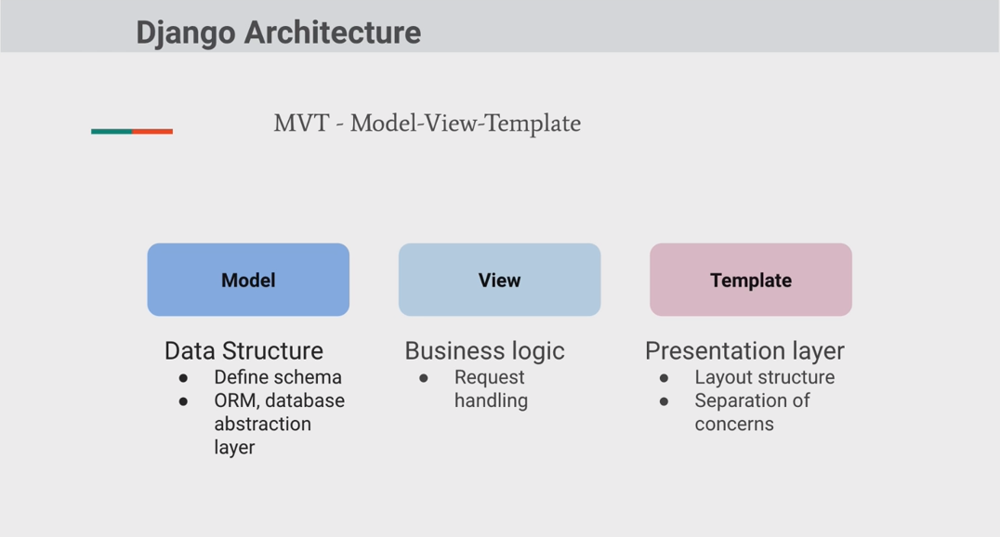
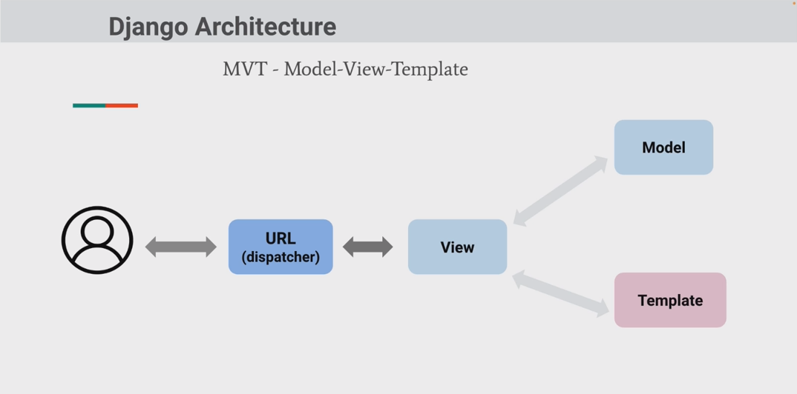
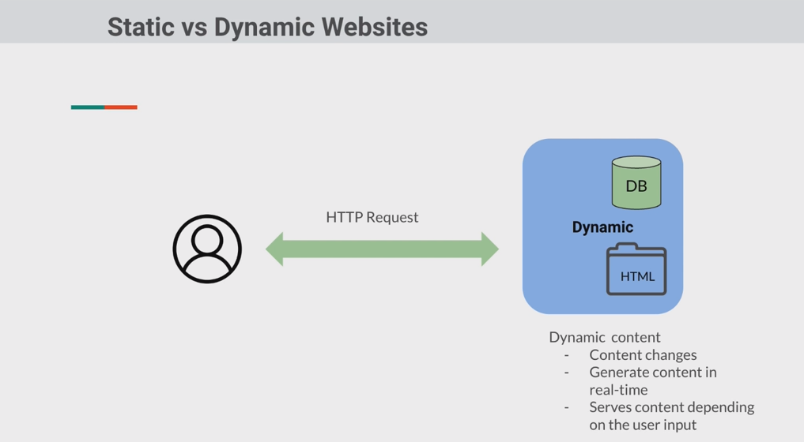
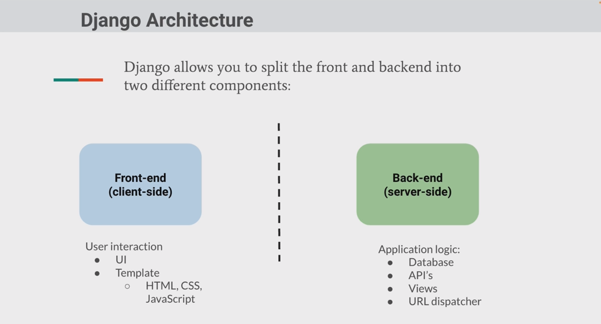
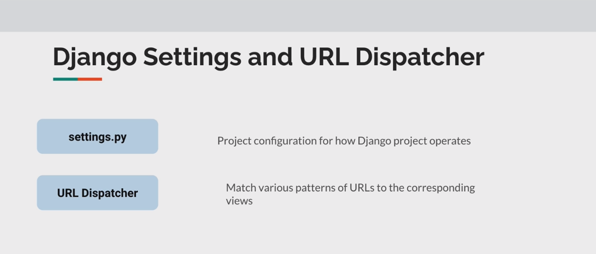
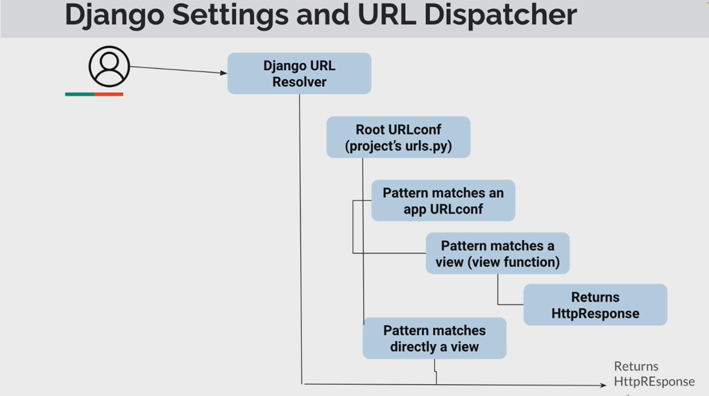
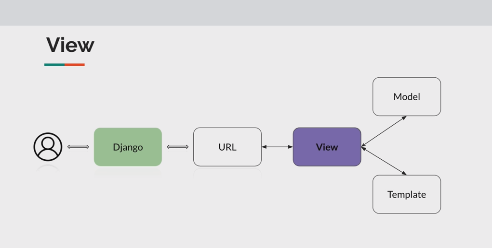
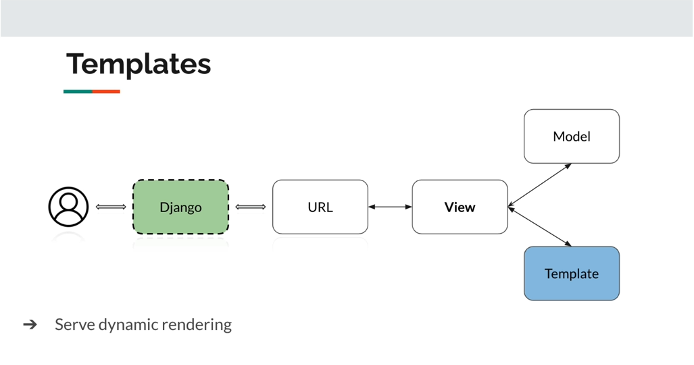
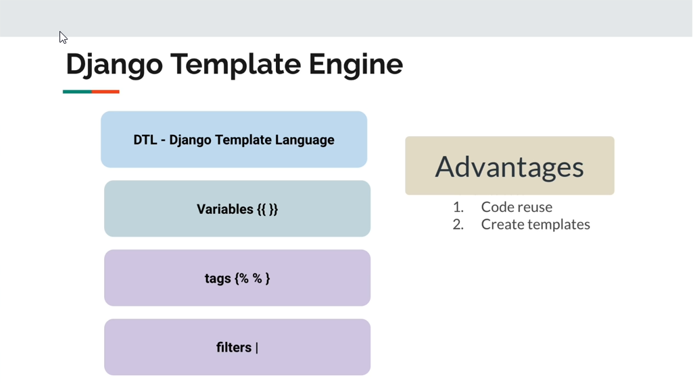

# Section 3 - Django Fundamentals - Deep Dive

## 3.1 Initial Setup

1- Install Python 3.12 and Update pip to latest version

```shell
# Go to www.python.org to download the installer files
# Then install Python 3.12.3 for macOS/Linux/Windows

# Upgrade pip to latest version for the Host 
python3 -m pip install --upgrade pip  ## macOS and Linux
python -m pip install --upgrade pip   ## Windows
```

2- Create a project folder and create/activate the virtual Env

```shell
mkdir foodie
cd foodie

python -m venv venv
venv/bin/activate        ## macOS, Linux
./venv/scripts/activate  ## Windows

# Upgrade pip to latest version for the Venv 
python3 -m pip install --upgrade pip  ## macOS and Linux
python -m pip install --upgrade pip   ## Windows
```

3- Install Django

```shell
pip install django
## pip install -r requirements.txt
```

4- Create the project named `foodie` in current folder (`.`)

```shell
django-admin startproject foodie .
```

## 3.2 - Django Project File Structure

> foodie/
> 
> ├── foodie/
> │   ├─\__init__.py
> │   ├─ asgi.py
> │   ├─ settings.py
> │   ├─ urls.py
> │   ├─ wsgi.py
> ├── manage.py
> ├── venv/

## 3.3 Apps and Running up the Server

1- Start a sandbox app

```shell
django-admin startapp sandbox
```

2- Initial running up the server

```shell
python manage.py runserver
```

3- add more routes

```shell
## Create a urls.py in sandbox folder
touch sandbox/urls.py
```

4- edit the sandbox/urls.py

```python
from django.urls import path
from . import views

urlpatterns = [
    path("", views.index)
]
```

5- edit sandbox/views.py

```python
from django.http import HttpResponse
from django.shortcuts import render

# Create your views here.
def index(request):
    return HttpResponse("Hello World!")
```

6- Import the urls of sandbox to foodie/urls.py

```python
urlpatterns = [
    path('admin/', admin.site.urls),
    path('sandbox/', include('sandbox.urls')),
]
```

7- add the app (sandbox) to foodie/settings.py

```python
INSTALLED_APPS = [
    # my apps
    'sandbox',
    'django.contrib.admin',
    'django.contrib.auth',
    'django.contrib.contenttypes',
    'django.contrib.sessions',
    'django.contrib.messages',
    'django.contrib.staticfiles',
]
```

8- Go to http://127.0.0.1:8000/sandbox to try

## 3.4 Django MVT Architecture

1- Building Web Apps with Django

​    --> Define URLs --> Writing Views --> Writing Templates

2- Django Architecture

MVT - Functions - 

MVT - Data flow - 

## 3.5 Change routes of foodie/urls.py

```shell
urlpatterns = [
    path('admin/', admin.site.urls),
    path('', include('sandbox.urls')),
]
```

## 3.6 Passing data to the Response in app's view

```shell
from random import choice
from django.http import HttpResponse
from django.shortcuts import render

fruits = [
    'mangoes',
    'pears',
    'oranges'
]
# Create your views here.
def index(request):
    data = choice(fruits)
    return HttpResponse(f"Hello there {data}")
```

## 3.7 Static vs Dynamic Websites






## 3.8 Django Settings and URL Dispatcher





## 3.9 Django Views - Deep Dive



## 3.10 Django Templates





## 3.11 Creating an index.html

```shell
touch sandbox/templates/sandbox/index.html
## install djLint
python -m pip install -U djlint
## also install "djLint" and "Django", and "jinja" in VS Code Extension

```

## 3.12 Passing dynamic data to template index.html

The `sandbox/views.py` is like:

```python
# from random import choice
from django.http import HttpResponse
from django.shortcuts import render

dataset = {"name": "Marcus", "age": 123}
context = {"data": dataset}
# Create your views here.
def index(request):
    return render(request, "sandbox/index.html", context)
```

The `sandbox/templates/sandbox/index.html` is like:

```html
<!DOCTYPE html>
<html lang="en">
<head>
    <meta charset="UTF-8">
    <meta name="viewport" content="width=device-width, initial-scale=1.0">
    <title>foodie</title>
</head>
<body>
    <p>Hello World! {{ data.name }}</p>
</body>
</html>
```

## 3.13 DTL - Tags and Looping Through a List

 The sandbox/views.py be like:

```
...
foodset = ["Pizza", "Pasta", "Salad", "Bread"]
context = {"foods": foodset}
...
```

The index.html be like:

```html
<!DOCTYPE html>
<html lang="en">
<head>
    <meta charset="UTF-8">
    <meta name="viewport" content="width=device-width, initial-scale=1.0">
    <title>foodie</title>
</head>
<body>
    <p>Hello World! {{ data.name }}</p>

    
        <ul>
            
                <li>
                    {{ food }}
                </li>
            
        </ul>
    
        <p> No food found. </p>
    

</body>
</html>
```

## 3.14 DTL - Add else tag

as per above

## 3.15 Creating base template and extend it

Create a base.html

```html
<!DOCTYPE html>
<html lang="en">
<head>
    <meta charset="UTF-8">
    <meta name="viewport" content="width=device-width, initial-scale=1.0">
    <title>foodie</title>
</head>
<body>
    <nav>
        <div>Foodie</div>
    </nav>

    <div class="container">
         

         

    </div>

</body>
</html>
```

change the Index.html

```html



    
        <ul>
            
                <li>
                    {{ food }}
                </li>
            
        </ul>
    
        <p> No food found. </p>
    


```

