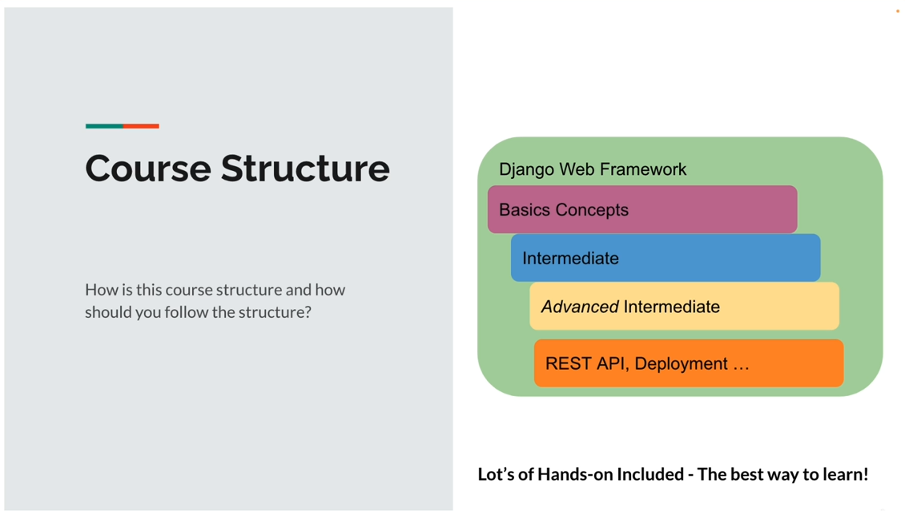
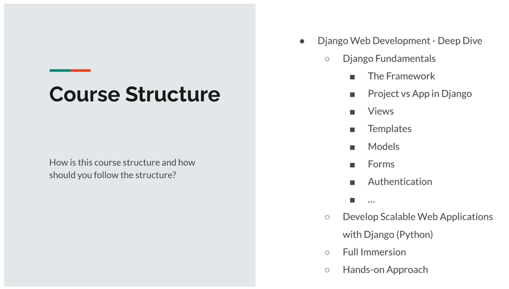
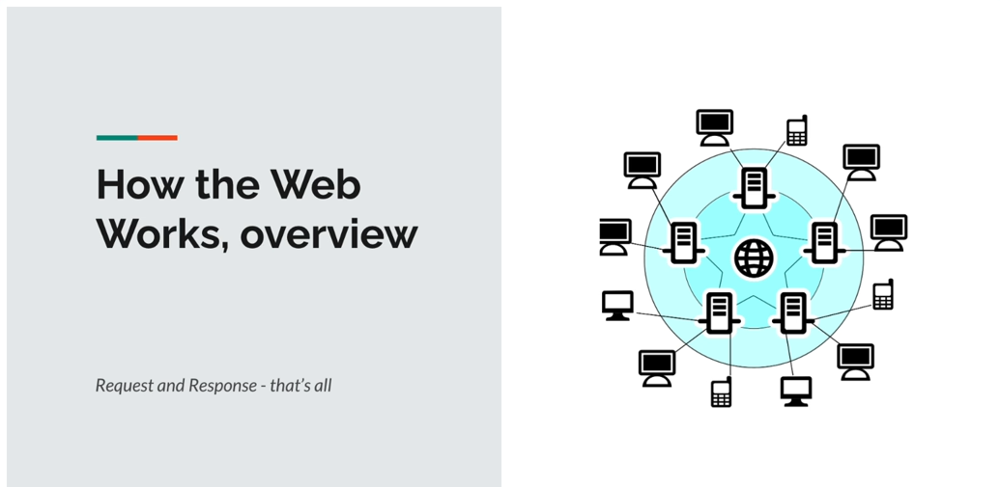
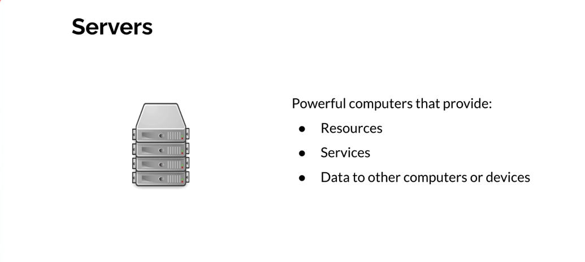
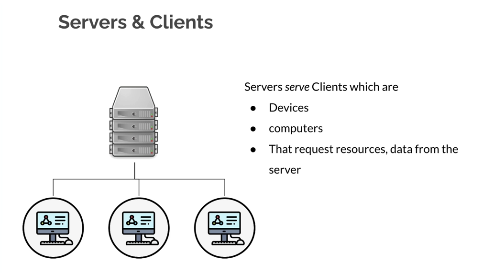
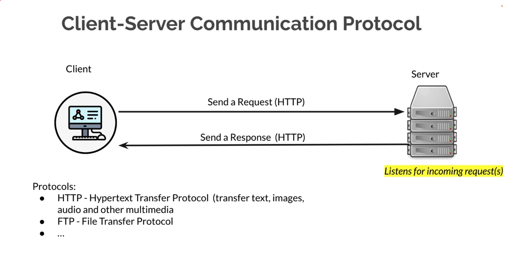
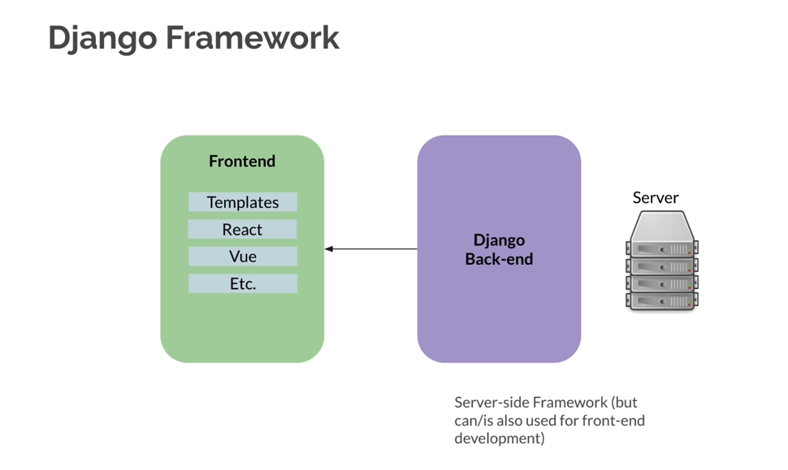

# Section 1 - Introduction

## 1.1 Intro

### What is this course About?

- Introduction to Django Web Framework

### Who is this course for?

- anyone wanting to learn Web Development with Django Web Framework!

### Prerequisites

1. HTML & CSS

2. Python

### Course Structure

## 

## 1.2 Project Demo

 

## 1.3 Django Framework Overview

- Whats is framwork?

- - A set of tools, libraries, conventions, and best practices that are designed to solve common prblems and sreamline the development process

- What is Django?
  
  - A web framework for rapid development
    
    - Build applications fast
      
      - Build-in features
      
      - ORM
      
      - Template Engine
      
      - Authentication
    
    - Securely
    
    - Scalably
  
  - ghfghfgh

- How's Django used in the world
  
  - Used by big companies: Pinterest, Instagram, Mozilla, and more...

- Projects vs. Apps in Django

- How the web works

 

## 1.4 How the Web works & Server-Client Comms

