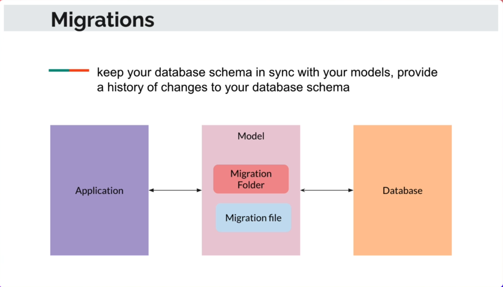
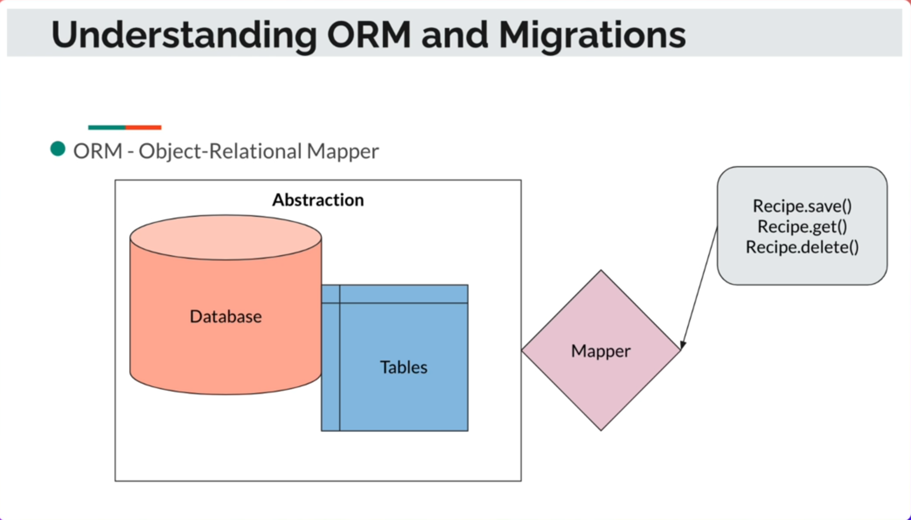
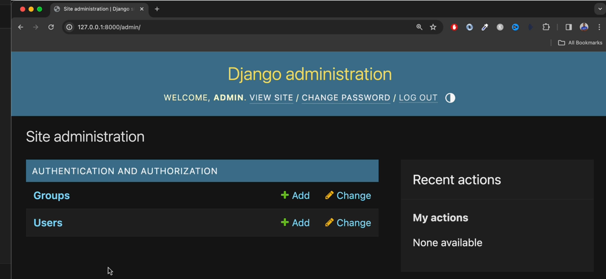

# Section 4 - Django Models, Database, ORM & Migrations

## 

## 4.1 Intro to Django Models


## 4.2 Models and Relationships


**Model**: A single, definitive source of information about your data

        Examples: Recipe, Categoty, Address, etc...


## 4.3 Restructure Code - Creating the Foodie App

```shell
python manage.py startapp foodie_app
```

then create/change the contents of `foodie_app/urls.py`

```python
from django.urls import path
from . import views

app_name = "foodie_app"
urlpatterns = [
    path("", views.index)
]
```

The `foodie_app/views.py`

```python
from django.shortcuts import render

# Create your views here.
def index(request):
    return render(request, "foodie_app/index.html")
```

and the `foodie_app/templates/foodie_app/index.html`:

```html
<!DOCTYPE html>
<html lang="en">
<head>
    <meta charset="UTF-8">
    <meta name="viewport" content="width=device-width, initial-scale=1.0">
    <title>Foodie_app</title>
</head>
<body>
    <p>Foodie_App</p>
</body>
</html>
```

finally add " 'foodie_app', " to `foodie/settings.py`.

## 4.4 Restructuring base.html

1- Move the `sandbox/templates/sandbox/base.html` to `templates/base.html`

2- Modify `foodie/settings.py: TEMPLATES --> 

```
"DIRS": [BASE_DIR / 'templates' ] 
```

3- Modify the `foodie_app/templates/foodie_app/index.html`

```django


    Hello there from Foodie App!

```

## 4.5 Migrations

1- Intro to Migrations



```shell
python manage.py migrate
```

2- Install `sqlite` in VS Code's Extensions. Then press `Coommand+Shift+P` to open up the command box, type in "SQLite" and select "SQLite: Open Database".

3- Understanding ORM and Migrations




## 4.6 Create the Category Model

1- Edit `foodie_app/models.py` be like:

```python
from django.db import models

# Create your models here.
class Category(models.Model):
    name = models.CharField(max_length=100)
    
    def __str__(self):
        return self.name
```

2- Then migrate the new model

```shell
python manage.py makemigrations foodie_app
python manage.py migrate
```

3- Open SQLite Explorer to inspect the new table - `foodie_app_category`


## 4.7 Django shell

```shell
python manage.py shell
```

Then you'll enter into the Django Shell:-

```shell
from foodie_app.models import Category
categories = Category.objects.all()
print(categories)
```

then it will return with a empty QuerySet. 

So create some data to the table as below:-

```shell
cat = Catgory.objects.create(name="Marcus")
print(categories)

cat = Category.objects.create(name="Desert")
print(categories)

for categoty in categories:
	print(category)
```

Check out at SQLite Explorer as well.

## 4.8 the Django Admin site

```shell
python manage.py createsuperuser
## type in the admin user name: admin
## type in the email and password
## Please remember this password: (mine: P@ssword1)
```

Then go to http://127.0.0.1:8000/admin, login as `admin`:-


