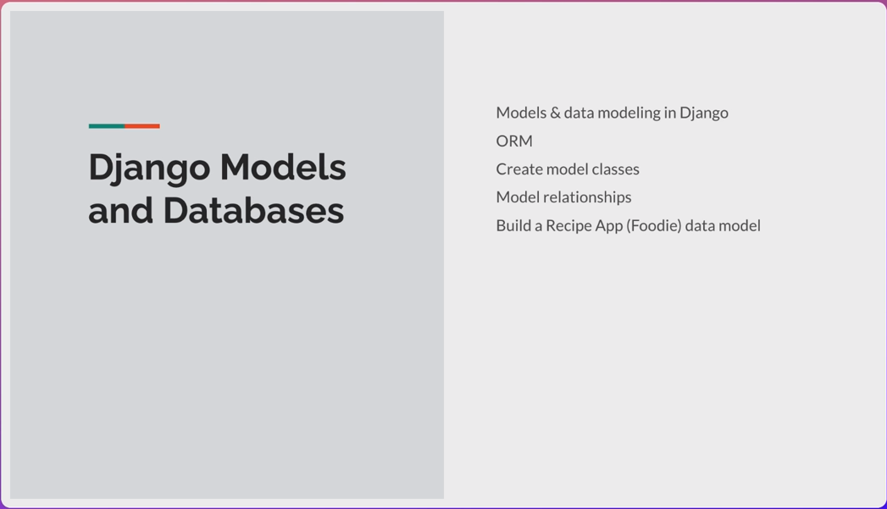

# Section 4 - Django Models, Database, ORM & Migrations

## 

## 4.1 Intro to Django Models





## 4.2 Models and Relationships


**Model**: A single, definitive source of information about your data

        Examples: Recipe, Categoty, Address, etc...


## 4.3 Restructure Code - Creating the Foodie App

```shell
python manage.py startapp foodie_app
```

then create/change the contents of `foodie_app/urls.py`
