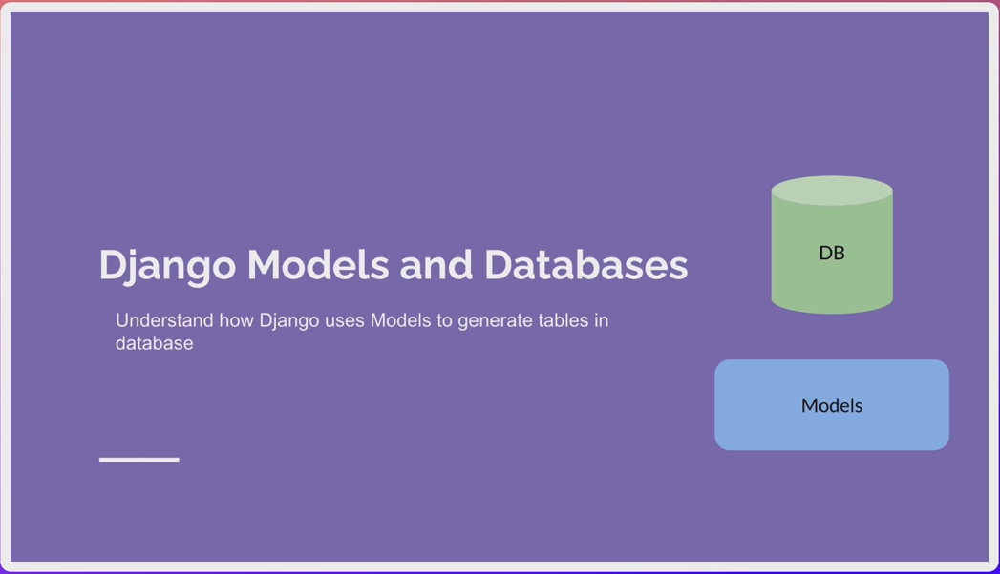

# Section 4 - Django Models, Database, ORM & Migrations

## 

## 4.1 Intro to Django Models




## 4.2 Models and Relationships


**Model**: A single, definitive source of information about your data

        Examples: Recipe, Categoty, Address, etc...


## 4.3 Restructure Code - Creating the Foodie App

```shell
python manage.py startapp foodie_app
```

then create/change the contents of `foodie_app/urls.py`

```python
from django.urls import path
from . import views

app_name = "foodie_app"
urlpatterns = [
    path("", views.index)
]
```

The `foodie_app/views.py`

```python
from django.shortcuts import render

# Create your views here.
def index(request):
    return render(request, "foodie_app/index.html")
```

and the `foodie_app/templates/foodie_app/index.html`:

```html
<!DOCTYPE html>
<html lang="en">
<head>
    <meta charset="UTF-8">
    <meta name="viewport" content="width=device-width, initial-scale=1.0">
    <title>Foodie_app</title>
</head>
<body>
    <p>Foodie_App</p>
</body>
</html>
```

finally add " 'foodie_app', " to `foodie/settings.py`.

## 4.4 Restructuring base.html

1- Move the `sandbox/templates/sandbox/base.html` to `templates/base.html`

2- Modify `foodie/settings.py: TEMPLATES --> 

```
"DIRS": [BASE_DIR / 'templates' ] 
```

3- Modify the `foodie_app/templates/foodie_app/index.html`

```django


    Hello there from Foodie App!

```

## 4.5 Migrations

1- Intro to Migrations


```shell
python manage.py migrate
```

2- Install `sqlite` in VS Code's Extensions. Then press `Coommand+Shift+P` to open up the command box, type in "SQLite" and select "SQLite: Open Database".

3- Understanding ORM and Migrations


## 4.6 Create the Category Model

1- Edit `foodie_app/models.py` be like:

```python
from django.db import models

# Create your models here.
class Category(models.Model):
    name = models.CharField(max_length=100)

    def __str__(self):
        return self.name
```

2- Then migrate the new model

```shell
python manage.py makemigrations foodie_app
python manage.py migrate
```

3- Open SQLite Explorer to inspect the new table - `foodie_app_category`

## 4.7 Django shell

```shell
python manage.py shell
```

Then you'll enter into the Django Shell:-

```shell
from foodie_app.models import Category
categories = Category.objects.all()
print(categories)
```

then it will return with a empty QuerySet. 

So create some data to the table as below:-

```shell
cat = Catgory.objects.create(name="Marcus")
print(categories)

cat = Category.objects.create(name="Desert")
print(categories)

for categoty in categories:
    print(category)
```

Check out at SQLite Explorer as well.

## 4.8 the Django Admin site

```shell
python manage.py createsuperuser
## type in the admin user name: admin
## type in the email and password
## Please remember this password: (mine: P@ssword1)
```

Then go to http://127.0.0.1:8000/admin, login as `admin`:-


Back to app folder to Register models with `foodie_app/admin.py` in each app folder:

```python
from django.contrib import admin
from .models import Category

# Register your models here.
admin.site.register(Category)
```

then back to Admin site to refresh the website to add more category of the food, say pizza, drinks, and salad, etc.

## 4.9 Modifying a Model and Running Migrations

insert one line into `foodie_app/models.py` as below:

```python
from django.db import models

# Create your models here.
class Category(models.Model):
    name = models.CharField(max_length=100)
    date_added = models.DateField(auto_now_add=True)

    def __str__(self):
        return self.name    
```

Then run command:

```shell
python manage.py makemigrations foodie_app
## 
## Select `1` to provide a One-Off default value
## type in `timezone.now()` to generate the value.
## Then review the `migrations/0002_category_date_added.py` file
##
python manage.py migrate
```

SQLite Explorer will show the `date_added` column ("field"), but Django Admin site shows the same as before, why? will trouble-shoot later

## 4.10 Customizing the Admin Interface and Show More Fields on the Models

Change `foodie_app/admin.py` as below:

```python
## foodie_app/admin.py

from django.contrib import admin
from .models import Category

# Customize the display in admin site
class CategoryAdmin(admin.ModelAdmin):
    list_display = ("id", "name", "date_added")
    search_fields = ["name"]

# Register your models here.
admin.site.register(Category, CategoryAdmin)
```

## 4.11 Create the Recipe Model

Create the Recipe model in `foodie_app/models.py` file:

```python
from django.db import models

# Create Category model
class Category(models.Model):
    name = models.CharField(max_length=100)
    date_added = models.DateField(auto_now_add=True)

    def __str__(self):
        return self.name

# Create Recipe model
class Recipe(models.Model):
    name = models.CharField(max_length=100)
    description = models.TextField(null=True, blank=True)
    ingredients = models.TextField()
    directions = models.TextField()
    date_added = models.DateTimeField(auto_now_add=True, null=True, blank=True)
    category = models.ForeignKey(Category, on_delete=models.CASCADE)

    def __str__(self):
        return self.name   
```

Then register the model in `foodie_app/admin.py` file:

```python
from django.contrib import admin
from .models import Category, Recipe

# Customize the display in admin site
class CategoryAdmin(admin.ModelAdmin):
    list_display = ("id", "name", "date_added")
    search_fields = ["name"]

class RecipeAdmin(admin.ModelAdmin):
    list_display = ("id", "name", "date_added")
    search_fields = ["name"]

# Register your models here.
admin.site.register(Category, CategoryAdmin)
admin.site.register(Recipe, RecipeAdmin)
```

then migrate the models to database:

```shell
python manage.py makemigrations foodie_app
python manage.py migrate
```

Open the Admin site to add your first Recipe as below:

```textile
Green Salad
```

## 4.12 Creating the Recipe App & Code Refactor

Make a Recipe app for future re-uses.

```shell
python manage.py startapp recipes
```

then copy the Recipe Class of `foodie_app/models.py` to `recipes/models.py`:

 ...
