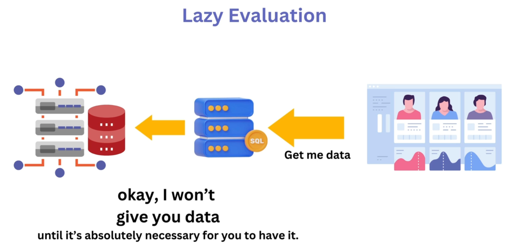

# Section 5 - Django QuerySet API

 

## 5.1 Django QuerySet API - Overview

QuerySet:

- Collection of Database queries

- Lazily Evaluated



Then modify the `recipes/views.py` :

```python
# recipes/views.py
from django.http import HttpResponse
from django.shortcuts import render

from recipes.models import Recipe

# Create your views here.
def recipes(request):
    recipes = Recipe.objects.all()
    print("Recipes", recipes)

    return HttpResponse("Hello from Recipes")
```

Open http://127.0.0.1:8000/recipes/. the query set results shall show up in the terminal.

There are a few methods:

​    .all()

​    .first()

​    .get(pk=4)

​    .get(id=1)


## 5.2 QuerySet API - Using filter with contains & exact Field Lookups

**Method**: .filter(category="Salad")

But `recipes = Recipe.objects.filter(category="Salad")` will cause issue, because `category` is actually a foreign key from `Categoty` module. Then we need to change to `category__name__exact="Salad"` or `category__name__iexact="Salad"`.

```python
# recipes/views.py
from django.http import HttpResponse
from django.shortcuts import render

from recipes.models import Recipe

# Create your views here.
def recipes(request):
    recipes = Recipe.objects.filter(category__name__iexact="salad")

    print("Recipes", recipes)
    return HttpResponse("Hello from Recipes")
```

Another filter option is `filter(category__name__icontains="Salad another")`.

 

## 5.3 QuerySet API - Using the exclude Type

Method:`.exclude(name__contains="Soup")`

```python
# recipes/views.py
from django.http import HttpResponse
from django.shortcuts import render
from recipes.models import Recipe

# Create your views here.
def recipes(request):
    # recipes = Recipe.objects.filter(category__name__iexact="Soup")
    recipes = Recipe.objects.exclude(name__contains="Chocolate")

    print("Recipes", recipes)
    return HttpResponse("Hello from Recipes")
```

Refresh http://127.0.0.1:8000/recipes/ and check the results in Terminal.


## 5.4 QuerySet API - Filter Chaining

1- Method changed to:

```python
# recipes/views.py
from django.http import HttpResponse
from django.shortcuts import render

from recipes.models import Recipe

# Create your views here.
def recipes(request):
    # recipes = Recipe.objects.all()
    # recipes = Recipe.objects.filter(category__name__iexact="salad")
    # recipes = Recipe.objects.exclude(name__contains="Chocolate")
    recipes = Recipe.objects.filter(category__name__iexact="Soup").exclude(name__contains="chocolate").order_by("-date_added")

    print("Recipes", recipes)
    return HttpResponse("Hello from Recipes")
```

2- Refresh http://127.0.0.1:8000/recipes/ while checking the outputs in the Terminal:

```textile
Recipes <QuerySet [<Recipe: Chicken Noodle Soup>]>
```


## 5.5 QuerySet API - Slicing QuerySets and Aggregation

Update the method to a slicer: `all()[:3]`

```python
# recipes/views.py
from django.http import HttpResponse
from django.shortcuts import render

from recipes.models import Recipe

# Create your views here.
def recipes(request):
    # recipes = Recipe.objects.all()
    # recipes = Recipe.objects.filter(category__name__iexact="salad")
    # recipes = Recipe.objects.exclude(name__contains="Chocolate")
    # recipes = Recipe.objects.filter(category__name__iexact="Soup").exclude(name__contains="chocolate").order_by("-date_added")
    recipes = Recipe.objects.all()[:3]

    print("Recipes", recipes)
    return HttpResponse("Hello from Recipes")
```

Refresh the website and check the results in terminal be like:

```textile
Recipes <QuerySet [<Recipe: Greek Salad>, <Recipe: Caesar Salad>, <Recipe: Chocolate Lava Cake>]>
```

 Update the method to a aggregatpr: `.aggregate(Count('id')`:

```python
# recipes/views.py
from django.http import HttpResponse
from django.shortcuts import render
from recipes.models import Recipe
from django.db.models import Avg, Count, Sum, Max, Min

# Create your views here.
def recipes(request):
    # recipes = Recipe.objects.all()
    # recipes = Recipe.objects.filter(category__name__iexact="salad")
    # recipes = Recipe.objects.exclude(name__contains="Chocolate")
    # recipes = Recipe.objects.filter(category__name__iexact="Soup").exclude(name__contains="chocolate").order_by("-date_added")
    # recipes = Recipe.objects.all()[:3]
    recipes = Recipe.objects.aggregate(Count("id"))

    print("Recipes", recipes)
    return HttpResponse("Hello from Recipes")
```

The output be like:

```textile
Recipes {'id__count': 5}
```


## 5.6 The Django Documentation - Field Lookups - Using Greater Than

The Django Documentation site: https://docs.djangoproject.com/en/5.1/ref/models/querysets/

Lets try the field lookup of `greater than`: gt

```python
def recipes(request):
    # recipes = Recipe.objects.all()
    # recipes = Recipe.objects.filter(category__name__iexact="salad")
    # recipes = Recipe.objects.exclude(name__contains="Chocolate")
    # recipes = Recipe.objects.filter(category__name__iexact="Soup").exclude(name__contains="chocolate").order_by("-date_added")
    # recipes = Recipe.objects.all()[:3]
    # recipes = Recipe.objects.aggregate(Count("id"))
    recipes = Recipe.objects.filter(id__gt=3)


    print("Recipes", recipes)
    return HttpResponse("Hello from Recipes")
```

The output be like: it's gonna be 2 items.

```textile
Recipes <QuerySet [<Recipe: Mojito>, <Recipe: Chicken Noodle Soup>]>
```

Try other field lookups: `gte`, `startswith`, `iendswith`, `iso_week_day`, `regex`, etc.


## 5.7 QuerySet API - Complex Queries with the Q Object

Update the method to a filter: Q with logical operators: &, I...

```python
# recipes/views.py
from django.http import HttpResponse
from django.shortcuts import render
from recipes.models import Recipe
from django.db.models import Avg, Count, Sum, Max, Min
from django.db.models import Q

# Create your views here.
def recipes(request):
    # recipes = Recipe.objects.all()
    # recipes = Recipe.objects.filter(category__name__iexact="salad")
    # recipes = Recipe.objects.exclude(name__contains="Chocolate")
    # recipes = Recipe.objects.filter(category__name__iexact="Soup").exclude(name__contains="chocolate").order_by("-date_added")
    # recipes = Recipe.objects.all()[:3]
    # recipes = Recipe.objects.aggregate(Count("id"))
    # recipes = Recipe.objects.filter(id__gt=3)
    recipes = Recipe.objects.filter(Q(name__startswith="M") | Q(description__icontains="lava"))

    print("Recipes", recipes)
    return HttpResponse("Hello from Recipes")
```

The output in Terminal be like: 

```textile
Recipes <QuerySet [<Recipe: Chocolate Lava Cake>, <Recipe: Mojito>]>
```


## 5.8 QuerySet API - values, value_list, count and exists Functions

Update the method to a filterwith values() or value_list() functions.

```python
# recipes/views.py
from django.http import HttpResponse
from django.shortcuts import render
from recipes.models import Recipe
from django.db.models import Avg, Count, Sum, Max, Min
from django.db.models import Q

# Create your views here.
def recipes(request):
    # recipes = Recipe.objects.all()
    # recipes = Recipe.objects.filter(category__name__iexact="salad")
    # recipes = Recipe.objects.exclude(name__contains="Chocolate")
    # recipes = Recipe.objects.filter(category__name__iexact="Soup").exclude(name__contains="chocolate").order_by("-date_added")
    # recipes = Recipe.objects.all()[:3]
    # recipes = Recipe.objects.aggregate(Count("id"))
    # recipes = Recipe.objects.filter(id__gt=3)
    # recipes = Recipe.objects.filter(Q(name__startswith="M") | Q(description__icontains="lava"))
    recipes = Recipe.objects.filter(id__gt=3).values()
    # recipes = Recipe.objects.filter(id__gt=3).values_list()
    # recipes = Recipe.objects.filter(id__gt=3).count()
    # recipes = Recipe.objects.filter(name__contains="Mojito").exists()

    print("Recipes", recipes)
    return HttpResponse("Hello from Recipes")"Hello from Recipes")
```

The output in Terminal be like: This is the whole datasets of id=4 and 5.

```textile
Recipes <QuerySet [{'id': 4, 'name': 'Mojito', 'description': 'An authentic recipe for a mojito cocktail', 'ingredients': '10 fresh mint leaves \r\n½ medium lime, cut into 3 wedges, divided \r\n2 tablespoons white sugar, or to taste \r\n1 cup ice cubes, or as needed \r\n1 ½ fluid ounces white rum \r\n½ cup club soda, or as needed', 'directions': '1. Gather the ingredients. \r\n2. Place mint leaves and 1 lime wedge into a sturdy glass. Use a muddler and crush to release mint oils and lime juice. \r\n3. Add remaining lime wedges and 2 tablespoons sugar, and muddle again to release the lime juice. Do not strain the mixture. \r\n4. Fill the glass almost to the top with ice. \r\n5. Pour in rum and fill the glass with club soda. \r\n6. Stir, taste, and add more sugar if desired.', 'date_added': datetime.datetime(2024, 11, 30, 19, 9, 8, 129072, tzinfo=datetime.timezone.utc), 'category_id': 1}, {'id': 5, 'name': 'Chicken Noodle Soup', 'description': "A chicken noodle soup recipe that's a very easy, very good substitute for when you don't have time to make your soup totally from scratch.", 'ingredients': '1 tablespoon butter \r\n½ cup chopped onion \r\n½ cup chopped celery \r\n4 (14.5 ounce) cans chicken broth \r\n1 (14.5 ounce) can vegetable broth \r\n½ pound chopped cooked chicken breast \r\n1 ½ cups egg noodles \r\n1 cup sliced carrots \r\n½ teaspoon dried basil \r\n½ teaspoon dried oregano', 'directions': '1. Melt butter in a large pot over medium heat. Add onion and celery and cook until just tender, about 5 minutes. \r\n2. Add chicken broth, vegetable broth, chicken, egg noodles, carrots, basil, oregano, salt, and pepper. Stir to combine and bring to a boil. \r\n3. Reduce heat and simmer for 20 minutes.', 'date_added': datetime.datetime(2024, 11, 30, 19, 9, 57, 828600, tzinfo=datetime.timezone.utc), 'category_id': 3}]>
```

Go ahead to test other functions: values_list, count, exists...


## End of the Section
