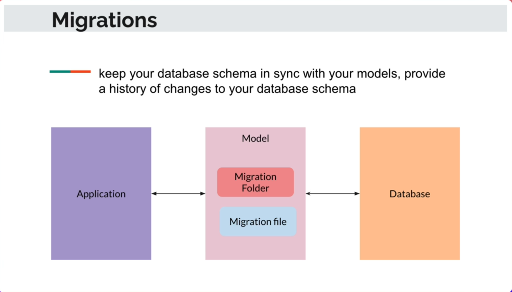
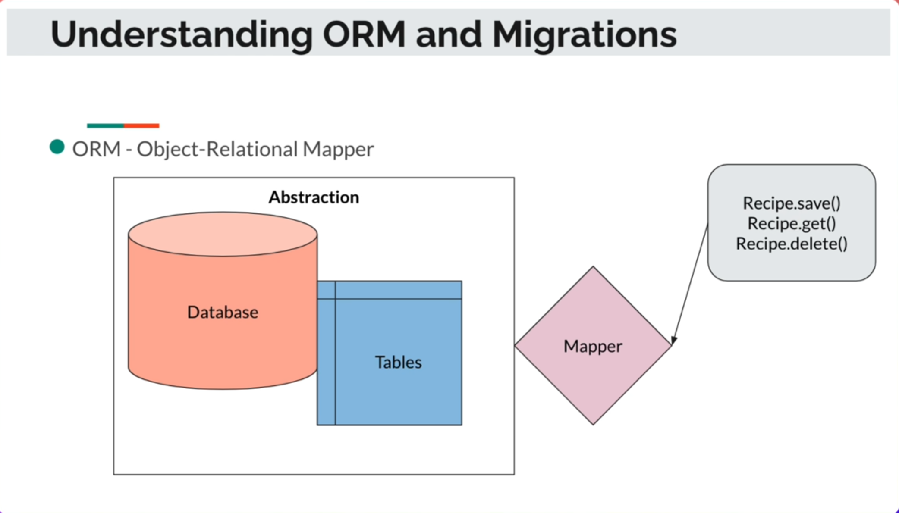
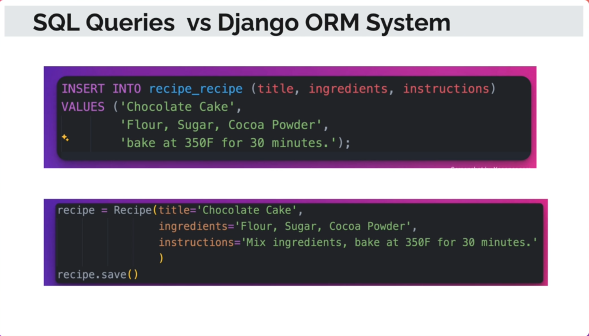
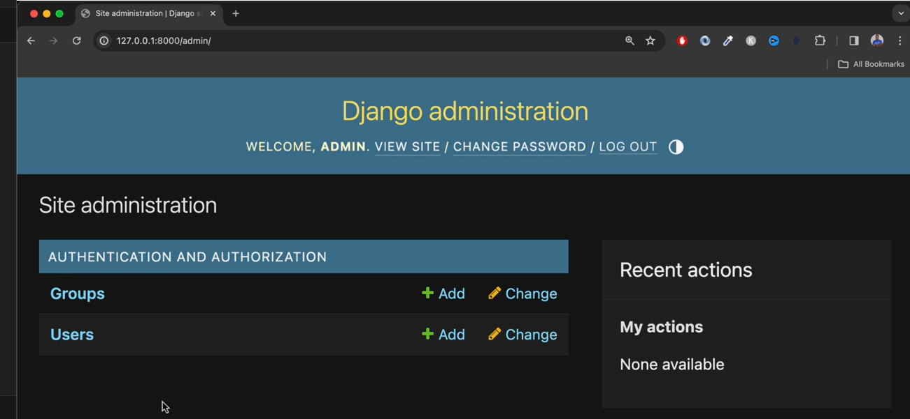

# Section 5 - Django QuerySet API


## 5.1 Django QuerySet API - Overview

QuerySet:

- Collection of Database queries

- Lazily Evaluated

  


Then modify the `recipes/views.py` :

```python
# recipes/views.py
from django.http import HttpResponse
from django.shortcuts import render

from recipes.models import Recipe

# Create your views here.
def recipes(request):
    recipes = Recipe.objects.all()
    print("Recipes", recipes)
    
    return HttpResponse("Hello from Recipes")
```

Open http://127.0.0.1:8000/recipes/. the query set results shall show up in the terminal.

There are a few methods:

​	.all()

​	.first()

​	.get(pk=4)

​	.get(id=1)


## 5.2 QuerySet API - Using filter with contains & exact Field Lookups

**Method**: .filter(category="Salad")

But `recipes = Recipe.objects.filter(category="Salad")` will cause issue, because `category` is actually a foreign key from `Categoty` module. Then we need to change to `category__name__exact="Salad"` or `category__name__iexact="Salad"`.

```python
# recipes/views.py
from django.http import HttpResponse
from django.shortcuts import render

from recipes.models import Recipe

# Create your views here.
def recipes(request):
    recipes = Recipe.objects.filter(category__name__iexact="salad")
    print("Recipes", recipes)
    return HttpResponse("Hello from Recipes")
```

Another filter option is `filter(category__name__icontains="Salad another")`.


## 5.3 QuerySet API - Using the exclude Type

Method:`.exclude(name__contains="Soup")`

```python
# recipes/views.py
from django.http import HttpResponse
from django.shortcuts import render
from recipes.models import Recipe

# Create your views here.
def recipes(request):
    # recipes = Recipe.objects.filter(category__name__iexact="Soup")
    recipes = Recipe.objects.exclude(name__contains="Chocolate")
    print("Recipes", recipes)
    return HttpResponse("Hello from Recipes"):
```


## 5.4 QuerySet API - Filter Chaining

1- Method changed to:

```python
## Filter Chaining with order_by
## `-` means descending.
recipes = Recipe.objects.filter(category__name__iexact="Soup").exclude(name__contains="Chocolate").order_by("-date_added")
```


2- Modify `foodie/settings.py: TEMPLATES --> 

```
"DIRS": [BASE_DIR / 'templates' ] 
```

3- Modify the `foodie_app/templates/foodie_app/index.html`

```django


    Hello there from Foodie App!

```


## 4.5 Migrations

1- Intro to Migrations



```shell
python manage.py migrate
```

2- Install `sqlite` in VS Code's Extensions. Then press `Coommand+Shift+P` to open up the command box, type in "SQLite" and select "SQLite: Open Database".

3- Understanding ORM and Migrations






## 4.6 Create the Category Model

1- Edit `foodie_app/models.py` be like:

```python
from django.db import models

# Create your models here.
class Category(models.Model):
    name = models.CharField(max_length=100)

    def __str__(self):
        return self.name
```

2- Then migrate the new model

```shell
python manage.py makemigrations foodie_app
python manage.py migrate
```

3- Open SQLite Explorer to inspect the new table - `foodie_app_category`


## 4.7 Django shell

```shell
python manage.py shell
```

Then you'll enter into the Django Shell:-

```shell
from foodie_app.models import Category
categories = Category.objects.all()
print(categories)
```

then it will return with a empty QuerySet. 

So create some data to the table as below:-

```shell
cat = Catgory.objects.create(name="Marcus")
print(categories)

cat = Category.objects.create(name="Desert")
print(categories)

for categoty in categories:
    print(category)
```

Check out at SQLite Explorer as well.


## 4.8 the Django Admin site

```shell
python manage.py createsuperuser
## type in the admin user name: admin
## type in the email and password
## Please remember this password: (mine: P@ssword1)
```

Then go to http://127.0.0.1:8000/admin, login as `admin`:-



Back to app folder to Register models with `foodie_app/admin.py` in each app folder:

```python
from django.contrib import admin
from .models import Category

# Register your models here.
admin.site.register(Category)
```

then back to Admin site to refresh the website to add more category of the food, say pizza, drinks, and salad, etc.


## 4.9 Modifying a Model and Running Migrations

insert one line into `foodie_app/models.py` as below:

```python
from django.db import models

# Create your models here.
class Category(models.Model):
    name = models.CharField(max_length=100)
    date_added = models.DateField(auto_now_add=True)

    def __str__(self):
        return self.name    
```

Then run command:

```shell
python manage.py makemigrations foodie_app
## 
## Select `1` to provide a One-Off default value
## type in `timezone.now()` to generate the value.
## Then review the `migrations/0002_category_date_added.py` file
##
python manage.py migrate
```

SQLite Explorer will show the `date_added` column ("field"), but Django Admin site shows the same as before, why? will trouble-shoot later


## 4.10 Customizing the Admin Interface and Show More Fields on the Models

Change `foodie_app/admin.py` as below:

```python
## foodie_app/admin.py

from django.contrib import admin
from .models import Category

# Customize the display in admin site
class CategoryAdmin(admin.ModelAdmin):
    list_display = ("id", "name", "date_added")
    search_fields = ["name"]

# Register your models here.
admin.site.register(Category, CategoryAdmin)
```


## 4.11 Create the Recipe Model

Create the Recipe model in `foodie_app/models.py` file:

```python
from django.db import models

# Create Category model
class Category(models.Model):
    name = models.CharField(max_length=100)
    date_added = models.DateField(auto_now_add=True)

    def __str__(self):
        return self.name

# Create Recipe model
class Recipe(models.Model):
    name = models.CharField(max_length=100)
    description = models.TextField(null=True, blank=True)
    ingredients = models.TextField()
    directions = models.TextField()
    date_added = models.DateTimeField(auto_now_add=True, null=True, blank=True)
    category = models.ForeignKey(Category, on_delete=models.CASCADE)

    def __str__(self):
        return self.name   
```

Then register the model in `foodie_app/admin.py` file:

```python
from django.contrib import admin
from .models import Category, Recipe

# Customize the display in admin site
class CategoryAdmin(admin.ModelAdmin):
    list_display = ("id", "name", "date_added")
    search_fields = ["name"]

class RecipeAdmin(admin.ModelAdmin):
    list_display = ("id", "name", "date_added")
    search_fields = ["name"]

# Register your models here.
admin.site.register(Category, CategoryAdmin)
admin.site.register(Recipe, RecipeAdmin)
```

then migrate the models to database:

```shell
python manage.py makemigrations foodie_app
python manage.py migrate
```

Open the Admin site to add your first Recipe as below:

```textile
Green Salad
```


## 4.12 Creating the Recipe App & Code Refactor

Make a Recipe app for future re-uses.

```shell
python manage.py startapp recipes
```

then copy the Recipe Class of `foodie_app/models.py` to `recipes/models.py`:

 ```python
 # recipes/models.py
 from django.db import models
 from foodie_app.models import Category
 
 # Create Recipe model
 class Recipe(models.Model):
     name = models.CharField(max_length=100)
     description = models.TextField(null=True, blank=True)
     ingredients = models.TextField()
     directions = models.TextField()
     date_added = models.DateTimeField(auto_now_add=True, null=True, blank=True)
     category = models.ForeignKey(Category, on_delete=models.CASCADE)
     
     def __str__(self):
         return self.name   
 ```

create a `recipes/urls.py` as below:

```python
# recipes/urls.py
from django.urls import path
from recipes import views

app_name = "recipes"
urlpatterns = [
    path("", views.recipes)
]
```

Update the `recipes/views.py` as below:

```python
# recipes/views.py
from django.http import HttpResponse
from django.shortcuts import render

# Create your views here.
def recipes(request):
    return HttpResponse("Hello from Recipes")
```

Also update `recipes/admin.py`:

```python
# recipes/admin.py
from django.contrib import admin
from .models import Recipe

# Customize the display in admin site
class RecipeAdmin(admin.ModelAdmin):
    list_display = ("id", "name", "date_added")
    search_fields = ["name"]

# Register your models here.
admin.site.register(Recipe, RecipeAdmin)
```

Finally insert the following into `INSTALLED_APPS` of project's `settings.py`:

```shell
'recipes',
```

And update project's `urls.py` by adding the url patterns for `recipes` app:

```python
from django.contrib import admin
from django.http import HttpResponse
from django.urls import include, path

urlpatterns = [
    path('admin/', admin.site.urls),
    path('sandbox/', include('sandbox.urls')),
    path('',  include('foodie_app.urls')),
    path('recipes/', include('recipes.urls')),
]
```

Then visit: http://127.0.0.1:8000/recipes/.


## 4.13 Running Migrations for the Recipe App

```shell
python manage.py makemigrations recipes
python manage.py migrate
```

then go to http://127.0.0.1:8000/admin/ to add some recipes:

| Name                | Description                                                  | Ingredients                                                  | Directions                                                   | Category |
| ------------------- | ------------------------------------------------------------ | ------------------------------------------------------------ | ------------------------------------------------------------ | -------- |
| Greek Salad         | perfect for summer when tomatoes and cucumbers taste best. The dressing is nice and tangy | 1 head romaine lettuce- rinsed, dried and chopped 1 cucumber, sliced 2 large tomatoes, chopped 1 (6 ounce) can pitted black olives 1 green bell pepper, chopped 1 red bell pepper, chopped 1 red onion, thinly sliced 1 cup crumbled feta cheese 6 tablespoons olive oil 1 lemon, juiced 1 teaspoon dried oregano ground black pepper to taste | 1. Combine romaine, cucumber, tomatoes, olives, bell peppers, and red onion in a large bowl; sprinkle with feta cheese. 2. Whisk olive oil, lemon juice, oregano, and black pepper together in a small bowl. Pour dressing over salad, toss well to combine, and serve. 3. Pour dressing over salad, toss well to combine, and serve. | Salad    |
| Caesar Salad        | an unbelievable, restaurant-quality, creamy Caesar salad dressing that will make you swear off of anything store-bought again | 2 anchovy fillets 2 cloves garlic, chopped, or to taste 1 cup mayonnaise ⅓ cup grated Parmesan cheese ¼ cup half-and-half 2 tablespoons fresh lemon juice 1 tablespoon Dijon mustard 2 teaspoons Worcestershire sauce | Combine anchovy fillets with garlic in a food processor and pulse several times to form a paste. Process mayonnaise, Parmesan cheese, half-and-half, lemon juice, Dijon mustard, and Worcestershire sauce with anchovy mixture until dressing is creamy. Refrigerate for 1 hour or more before serving. 2. | Salad    |
| Chocolate Lava Cake | So decadent yet so simple, you'll be saying 'flour who!?' when you let this sweet lava flow. | 8 ounces 70% bittersweet chocolate, finely chopped 12 tablespoons cold unsalted butter, cut into cubes 4 large eggs ½ cup granulated sugar ⅛ teaspoon salt | 1. Preheat oven to 375 degrees F. Adjust a rack to the middle of the oven. Butter six 4-ounce ramekins. 2. Put the chocolate and butter in a metal or glass bowl over barely simmering water. Stir occasionally until melted. Remove from the heat. 3. Place the eggs, sugar, and salt in the bowl of a mixer. Whip at medium-high speed until light and fluffy, about 5 minutes. Reduce speed to low and add the chocolate; mix until combined. Spoon into the prepared ramekins and place on a baking sheet. 4. Bake for about 10 minutes or until the edges are set but the center is underdone. Let cool 3 minutes before serving. | Desert   |
| Mojito              | authentic recipe for a mojito cocktail                       | 10 fresh mint leaves ½ medium lime, cut into 3 wedges, divided 2 tablespoons white sugar, or to taste 1 cup ice cubes, or as needed 1 ½ fluid ounces white rum ½ cup club soda, or as needed | 1. Gather the ingredients. 2. Place mint leaves and 1 lime wedge into a sturdy glass. Use a muddler and crush to release mint oils and lime juice. 3. Add remaining lime wedges and 2 tablespoons sugar, and muddle again to release the lime juice. Do not strain the mixture. 4. Fill the glass almost to the top with ice. 5. Pour in rum and fill the glass with club soda. 6. Stir, taste, and add more sugar if desired. | Drinks   |
| Chick Noodle Soup   | A chicken noodle soup recipe that's a very easy, very good substitute for when you don't have time to make your soup totally from scratch. | 1 tablespoon butter ½ cup chopped onion ½ cup chopped celery 4 (14.5 ounce) cans chicken broth 1 (14.5 ounce) can vegetable broth ½ pound chopped cooked chicken breast 1 ½ cups egg noodles 1 cup sliced carrots ½ teaspoon dried basil ½ teaspoon dried oregano | 1. Melt butter in a large pot over medium heat. Add onion and celery and cook until just tender, about 5 minutes. 2. Add chicken broth, vegetable broth, chicken, egg noodles, carrots, basil, oregano, salt, and pepper. Stir to combine and bring to a boil. 3. Reduce heat and simmer for 20 minutes. | Soup     |


## 4.14 Create the Comments App and Running Migrations

This is very similar as Section 4.12. 

Make a Comments app.

```shell
python manage.py startapp comments
```

create a `comments/urls.py` as below:

```python
# comments/urls.py
from django.urls import path
from comments import views

app_name = "comments"
urlpatterns = [
    path("", views.comments)
]
```

then update `comments/models.py`:

 ```python
# comments/models.py
from django.db import models
from recipes.models import Recipe

# Create Comment model
class Comment(models.Model):
    recipe = models.ForeignKey(Recipe, on_delete=models.CASCADE)
    text = models.TextField()
    date_added = models.DateTimeField(auto_now_add=True)
    
    def __str__(self):
        return self.text  
 ```

Update the `comments/views.py` as below:

```python
# comments/views.py
from django.http import HttpResponse
from django.shortcuts import render

# Create your views here.
def comments(request):
    return HttpResponse("Hello from Comments")
```

Also update `comments/admin.py`:

```python
# comments/admin.py
from django.contrib import admin
from .models import Comment

# Register your models here.
admin.site.register(Comment)
```

Finally insert the following into `INSTALLED_APPS` of project's `settings.py`:

```shell
'comments',
```

And update project's `urls.py` by adding the url patterns for `comments` app:

```python
from django.contrib import admin
from django.http import HttpResponse
from django.urls import include, path

urlpatterns = [
    path('admin/', admin.site.urls),
    path('sandbox/', include('sandbox.urls')),
    path('',  include('foodie_app.urls')),
    path('recipes/', include('recipes.urls')),
    path('comments/', include('comments.urls')),
]
```

Then visit: http://127.0.0.1:8000/comments/. and http://127.0.0.1:8000/admin/ to add comments for any recipes.


## End of the Section
