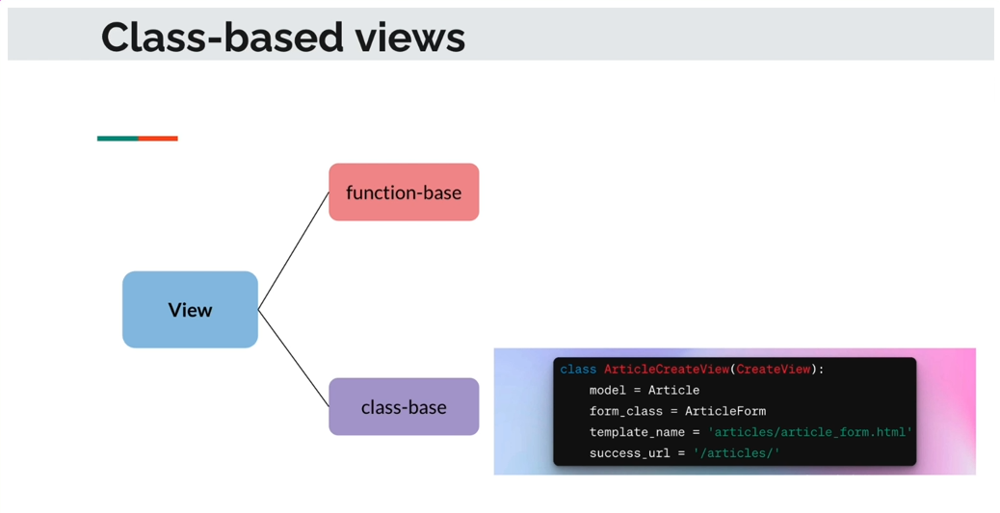

# Section 6 - Django Templates amd Static Files

## 6.1 Creating the base.html template, Navbar and Footer

1- Update the `templates/base.html` :

```html
<!DOCTYPE html>
<html lang="en">
<head>
    <meta charset="UTF-8">
    <meta name="viewport" content="width=device-width, initial-scale=1.0">
    <title>foodie</title>
</head>
<body>
    <nav>
        <div>Foodie</div>
    </nav>
    <main>
        <div class="container">
            
            
        </div>
    </main>
    <div>
        <hr>
        <footer>
            <pre>Footer</pre>
        </footer>
    </div>
</body>
</html>
```

2- Create the `recipes/templates/recipes/recipes.html` file:

```django


    All recipes go here!

```

3- Update the `recipes/views.py` file:

```python
# recipes/views.py
from django.http import HttpResponse
from django.shortcuts import render
from recipes.models import Recipe
from django.db.models import Avg, Count, Sum, Max, Min
from django.db.models import Q

# Create your views here.
def recipes(request):

    recipes = Recipe.objects.filter(name__contains="Mojito").exists()

    return render(request, "recipes/recipes.html")
```

4- Test out http://127.0.0.1:8000/recipes/ and http://127.0.0.1:8000/, they should have same interface as of now.

## 6.2 Showing all recipes in a Template

1- Change the `recipes/views.py`:

```python
# recipes/views.py
from django.shortcuts import render
from recipes.models import Recipe

# Create your views here.
def recipes(request):

    recipes = Recipe.objects.all()
    context = {"recipes": recipes}

    return render(request, "recipes/recipes.html", context)
```

2- Update the `recipes/templates/recipes/recipes.html`:

```django


    <div>
        
        <div>
            <h5> {{ recipe.name }} </h5>
            <p> {{ recipe.description }} </p>
        </div>
        
    </div>


```

3- Take a look at http://127.0.0.1:8000/recipes.

## 6.3 Showing the Recipes in the Details Template

1- Update the `recipes/urls.py`:

```python
# recipes/urls.py
from django.urls import path
from recipes import views

app_name = "recipes"
urlpatterns = [
    path("", views.recipes),
    path("<int:recipe_id>", views.recipe)
]
```

2- Update the `recipes/views.py`:

```python
# recipes/views.py
from django.shortcuts import render
from recipes.models import Recipe

# Create your views here.
def recipes(request):

    recipes = Recipe.objects.all()
    context = {"recipes": recipes}

    return render(request, "recipes/recipes.html", context)

def recipe(request, recipe_id):
    recipe = Recipe.objects.get(id=recipe_id)
    context = {
        "recipe": recipe
    }

    return render(request, "recipes/recipeDetails.html", context)
```

3- Create a detailed recipe html: `recipes/templates/recipes/recipeDetails.html`:

```django


    <div>
        <div>
            <h5> {{ recipe.name }} </h5>
        </div>
    </div>


```

4-  Then visit http://127.0.0.1:8000/recipes/3 for a look.

## 6.4 Adding URL Template Tag for Navigating to the Recipe Detail Page

1- Update `recipes/urls.py` adding the patern name (a.k.a. namespace):

```python
# recipes/urls.py
from django.urls import path
from recipes import views

app_name = "recipes"
urlpatterns = [
    # Adding pattern name in the end of each path PLEASE,
    # as such, serving the calling from recipes.html.
    path("", views.recipes, name="index"),
    path("<int:recipe_id>", views.recipe, name="recipe_detail"),
]
```

2- Maintain `recipes/views.py`:

```python
# recipes/views.py
from django.shortcuts import render
from recipes.models import Recipe

# Create your views here.
def recipes(request):

    recipes = Recipe.objects.all()
    context = {"recipes": recipes}

    return render(request, "recipes/recipes.html", context)

def recipe(request, recipe_id):
    recipe = Recipe.objects.get(id=recipe_id)
    context = {"recipe": recipe}

    return render(request, "recipes/recipeDetails.html", context)
```

3- Update the `recipes/templates/recipes/recipes.html`:

```django


    <div>
        
        <div>
            <h5> {{ recipe.name }} </h5>
            <p> {{ recipe.description }} </p>
            <a href="" > View Recipe Details </a>
        </div>
        
    </div>


```

4- Update `recipes/templates/recipes/recipeDetails.html`

```django


    <div>
        <div>
            <h5> {{ recipe.name }} </h5>
            <i>Description: </i>
            <p> {{ recipe.description }} </p>
            <i>Ingredients: </i>
            <p> {{ recipe.ingredients }} </p>
            <i>Directions: </i>
            <p> {{ recipe.directions }} </p>
        </div>
    </div>


```

5- Take a look at http://127.0.0.1:8000/recipes and click the link.

## 6.5 Redirecting the Home Page when Logo is Clicked

1- Update `templates/base.html` since all apps share the base.html:

```django
<!DOCTYPE html>
<html lang="en">
<head>
    <meta charset="UTF-8">
    <meta name="viewport" content="width=device-width, initial-scale=1.0">
    <title>foodie</title>
</head>
<body>
    <nav>
        <div>
            <a href=""> Foodie </a>
        </div>
    </nav>
    <main>
        <div class="container">
            
            
        </div>
    </main>
    <div>
        <hr>
        <footer>
            <pre>Footer</pre>
        </footer>
    </div>
</body>
</html>
```

2- Update the main app `foodie_app/urls.py`:

```python
# foodie_app/urls.py
from django.urls import path
from . import views

app_name = "foodie_app"
urlpatterns = [
    path("", views.index, name="index")
]
```

3- Give a try on any app page.

## 6.6 Show categories and navigating to All Recipes under Specific Category

1- Update `foodie_app/views.py`: 

```python
# foodie_app/views.py
from django.shortcuts import render
from .models import Category
from recipes.models import Recipe

# Create your views here.
def index(request):
    categories = Category.objects.all()
    context = {"categories": categories}

    return render(request, "foodie_app/index.html", context)

def recipes(request, category_id):
    recipes = Recipe.objects.filter(category=category_id)
    category = Category.objects.get(pk=category_id)

    context = {"recipes": recipes, "category": category}
    return render(request, "foodie_app/recipes.html", context)
```

2- Update `foodie_app/templates/foodie_app/index.html`:

```django


    <h3>Categories</h3>
    <div>
        
            <div>
                <a href=""> {{ category }} </a>
            </div>
        
    </div>

```

3- Create `foodie_app/templates/foodie_app/recipes.html`:

```django


    <h3>Recipes under <i>{{ category }}</i> </h3>
    <div>
        
            <div>
                <div>
                    <h5> {{ recipe.name }} </h5>
                    <p> {{ recipe.description }}</p>
                </div>
            </div>
        
    </div>

```

4- Update `foodie_app/urls.py`:

```python
# foodie_app/urls.py
from django.urls import path
from . import views

app_name = "foodie_app"
urlpatterns = [
    path("", views.index, name="index"),
    path("recipes/<int:category_id>/", views.recipes, name="recipes")
]
```

5- Try http://127.0.0.1:8000 : click "Salad" to view 2 Salads in the database!

## 6.7 The Meta Class and Options

The sub-class created inside a main class is called __meta class__. It's used for customizing the main class.

Update `foodie_app/models.py`:

```python
# foodie_app/models.py
from django.db import models

# Create Category model
class Category(models.Model):
    name = models.CharField(max_length=100)
    date_added = models.DateField(auto_now_add=True)

    class Meta:
        ## in descending order per 'name' or 'date_added'
        ordering = ["-date_added"]
        verbose_name = "Category"
        verbose_name_plural = "Categories"

    def __str__(self):
        return self.name
```

Documentation website for Meta Options: https://docs.djangoproject.com/en/5.1/ref/models/options/

## 6.8 Class-based Views

We've talked about function-based views quite a lot in the past sections, here is the Class-based Views:



Advantages of Class-based views:

- __Reusability__ - CBVs promote code reuse

- __Extensibility__ - easy to add or override functionality

- __Organization__ - help keep your code organized and structured


1- Update `sandbox/views.py`:

```python
# sandbox/views.py
from django.http import HttpResponse
from django.shortcuts import render
from django.views.generic import ListView

from recipes.models import Recipe

# Function based View
## data = ["Pizza", "Pasta", "Salad", "Bread"]
## context = {"foods", data}
data = Recipe.objects.all()
context = {"recipes": data}
# Create your views here.
def index(request):
    return render(request, "sandbox/index.html", context)

# Class-based View
class RecipeListView(ListView):
    model = Recipe
    template_name = "sandbox/index.html"
    context_object_name = "recipes"

```

2- Update `sandbox/urls.py`:

```python
# sandbox/urls.py
from django.urls import path
from . import views

app_name = "sandbox"
urlpatterns = [
    path("", views.index, name="index"),
    path('recipes/', views.RecipeListView.as_view(), name="recipes_list")
]
```

3- Update `sandbox/templates/sandbox/index.html`:

```django



    
        <ul>
            
                <li>
                    {{ recipe.name }}
                </li>
            
        </ul>
    
        <p> No reciped found. </p>
    


```

4- Take a look at http://127.0.0.1:8000/sandbox and http://127.0.0.1:8000/sandbox/recipes .

## 6.9 Class-based Biews - SHowing Details Page

1- Update `sandbox/urls.py` by adding one route:

```python
# sandbox/urls.py
from django.urls import path
from . import views

app_name = "sandbox"
urlpatterns = [
    path("", views.index, name="index"),
    path('recipes/', views.RecipeListView.as_view(), name="recipe_list"),
    path('recipes/<int:pk>', views.RecipeDetailView.as_view(), name="recipeDetail")
]
```

2- Update `sandbox/views.py`:

```python
# sandbox/views.py
from django.http import HttpResponse
from django.shortcuts import render
from django.views.generic import ListView, DetailView

from recipes.models import Recipe

# Function based View
## data = ["Pizza", "Pasta", "Salad", "Bread"]
## context = {"foods", data}
data = Recipe.objects.all()
context = {"recipes": data}
# Create your views here.
def index(request):
    return render(request, "sandbox/index.html", context)

# Class-based View
class RecipeListView(ListView):
    model = Recipe
    template_name = "sandbox/index.html"
    context_object_name = "recipes"

class RecipeDetailView(DetailView):
    model = Recipe
    template_name = "sandbox/recipeDetail.html"
    context_object_name = "recipe"
```

3- Create a `sandbox/templates/sandbox/recipeDetail.html`:

```django



    
        <article>
            <h2>{{ recipe.name }} </h2>
            Description: <p> {{ recipe.description }} </p>
            Ingredients: <p> {{ recipe.ingredients }} </p>
            Directions: <p> {{ recipe.directions }} </p>
        </article>
    
        <p> No recipes found. </p>
    


```

4- Update `sandbox/templates/sandbox/index.html` by adding the `<a href="">`:

```django



    
        <ul>
            
                <li>
                    <a href=""> {{ recipe.name }} </a>
                </li>
            
        </ul>
    
        <p> No reciped found. </p>
    


```

5- Take a look!


## End of the Section
