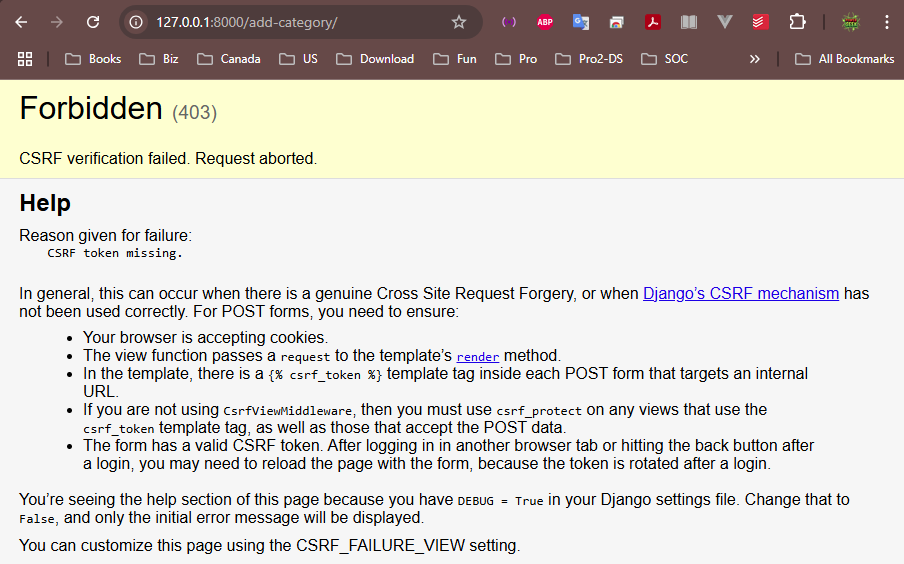

# Section 7 - Django Forms and User Inputs

## 7.1 Django Forms and User Inputs - Introduction

Django abstracts out -

- Rendering HTML forms
- Data validation
- Data conversion

Django defines Forms as Classes.

- RecipeForm
- Add_CategoryForm
- ...

1- Create a `foodie_app/forms.py` :

```python
from django import forms
from foodie_app.models import Category

class CategoryForm(forms.Form):
    model = Category
    fields = ["name"]
    labels = {"name": "Category Name"}
```

2- Update `foodie_app/views.py`:

```python
# foodie_app/views.py
from django.shortcuts import render

from foodie_app.forms import CategoryForm
from .models import Category
from recipes.models import Recipe

# Create your views here.
def index(request):
    categories = Category.objects.all()
    context = {"categories": categories}

    return render(request, "foodie_app/index.html", context)

def recipes(request, category_id):
    recipes = Recipe.objects.filter(category=category_id)
    category = Category.objects.get(pk=category_id)

    context = {"recipes": recipes, "category": category}
    return render(request, "foodie_app/recipes.html", context)

def add_category(request):
    form = CategoryForm
    context = {"form": form}
    return render(request, "foodie_app/add_category.html", context)
```

3- Create a `foodie_app/templates/foodie_app/add_category.html` :

```django


    <h3>Add Category</h3>
    <div>
        <form>
            {{ form.as_p}}
        </form>
    </div>

```

4- Update `foodie_app/urls.py`:

```python
# foodie_app/urls.py
from django.urls import path
from . import views

app_name = "foodie_app"
urlpatterns = [
    path("", views.index, name="index"),
    path("recipes/<int:category_id>/", views.recipes, name="recipes"),
    path("add-category/", views.add_category, name="Add_category")
]
```

5- Visit http://127.0.0.1:8000/add-category it works but the form defined in `forms.py` does not show up. 

What's going on?  It seems needing more fine-tuning.

## 7.2 Deep Dive into Forms

It looks the `foordie_app/forms.py` bears some issue, the `forms.Form` , which is very generic, shall be replaced with `forms.modelForm`. 

Also from Django 5.1.0+, the `model` call must be defined in a `Meta` class: This heacahe took me 20 minutes to figure it out. Damn.

```python
from django import forms
from foodie_app.models import Category

class CategoryForm(forms.ModelForm):
    class Meta:
        model = Category
        fields = ["name"]
        labels = {"name": "Category Name"}
```

Feel free to `inspect` via the browser while changing `form.as_p` to `form.as_div` in `add_category.html`.

Eventually we have upadted `foodie_app/views.py` a bit at `add_category` class:

```python
def add_category(request):
    if request.method == "POST":
        print(request.POST)
        form = CategoryForm(request.POST)
        context = {"form": form}
        return render(request, "foodie_app/index.html", context)
    else:
        form = CategoryForm
        context = {"form": form}
        return render(request, "foodie_app/add_category.html", context)
```

Also the `foodie_app/templates/foodie_app/add_category.html`:

```django


    <h3>Add Category</h3>
    <div>
        <form method="post">
            {{ form.as_p}}
            <button type="submit">Submit</button>
        </form>
    </div>

```

Then we give a go at http://127.0.0.1:8000/add-category, but it presents a "CSRF token missing" problem as below:



Basically, Django is all about security in first place, which asks a CSRF token when posting any data into the backend database (Submitting a Category randomly may harm the database, DEFINITELY). Then we have to tune the form.py a bit as we are in dev environment.

```django


    <h3>Add Category</h3>
    <div>
        <form method="post">
            
            {{ form.as_p}}
            <button type="submit">Submit</button>
        </form>
    </div>

```

You should observe no issue now! Beautiful!

## 7.3 Form Validation - Save and Redirect

1- Basically modify `foodie_app/views.py` using `redirect` mothod:

```python
# foodie_app/views.py
from django.shortcuts import redirect, render

from foodie_app.forms import CategoryForm
from .models import Category
from recipes.models import Recipe

# Create your views here.
def index(request):
    categories = Category.objects.all()
    context = {"categories": categories}

    return render(request, "foodie_app/index.html", context)

def recipes(request, category_id):
    recipes = Recipe.objects.filter(category=category_id)
    category = Category.objects.get(pk=category_id)

    context = {"recipes": recipes, "category": category}
    return render(request, "foodie_app/recipes.html", context)

def add_category(request):
    if request.method == "POST":
        # print(request.POST)
        form = CategoryForm(request.POST)
        if form.is_valid():
            form.save()
            return redirect("foodie_app:index")
        else:
            context = {"form": form}
            return render(request, "foodie_app/add_category.html", context)
    else:
        form = CategoryForm
        context = {"form": form}
        return render(request, "foodie_app/add_category.html", context)
```

2- Optionally update `foodie_app/templates/foodie_app/index.html` a bit:

```django


    <h3>Categories</h3>
    <div>
        <a href="">Add Category </a>
        
            <div>
                <a href=""> {{ category }} </a>
            </div>
        
    </div>

```

3- try to add a new category at http://127.0.0.1:8000/add-category

## 7.4 Custom Forms - Part 1

Go to `sandbox` playground.

1- Create a new `sandbox/forms.py`:

```python
# sandbox/forms.py
from django import forms

choices = [
    ('happy', 'Happy'),
    ("neutral", "Neutral"),
    ("sad", "Sad")
]

class FeedbackForm(forms.Form):
    name = forms.CharField(max_length=100)
    email = forms.EmailField()
    feedback = forms.CharField()
    satisfaction = forms.ChoiceField(choices=choices, widget=forms.RadioSelect)
```

2- Update `sandbox/models.py`:

```python
# sandbox/models.py
from django.db import models

class Feedback(models.Model):
    name = models.CharField(max_length=100)
    email = models.EmailField()
    feedback = models.TextField()
    satisfaction = models.CharField(max_length=10)

    def __str__(self):
        return self.name
```

3- Migrate the models in sandbox app:

```shell
python manage.py makemigrations sandbox
python manage.py migrate
```

4- Create a new `sandbox/templates/sandbox/feedback_form.html`:

```django



    <form method="post">
        
        {{ form.as_p }}
        <button type="submit">Submit</button>
    </form>


```

5- Update `sandbox/urls.py`:

```python
# sandbox/urls.py
from django.urls import path
from . import views

app_name = "sandbox"
urlpatterns = [
    path("", views.index, name="index"),
    path("recipes/", views.RecipeListView.as_view(), name="recipe_list"),
    path("recipes/<int:pk>", views.RecipeDetailView.as_view(), name="recipeDetail"),
    path("refreshing/", views.SpecificRecipesView.as_view(), name="refreshing_recipes"),
    path("feedback/", views.feedback, name ="feedback")
]
```

6- Update `sandbox/views.py`:

```python
def feedback(request):
    if request.method == "POST":
        form = FeedbackForm(request.POST)
        if form.is_valid():
            # process the form
            print(form.cleaned_data)
            return redirect('thank_you')
    else:
        form = FeedbackForm()

    context = {"form": form}
    return render(request, "sandbox/feedbacK_form.html", context)
```

7- Will continue in next sub-section.

## 7.5 Custom Forms - Part 2

1- Update `sandbox/urls.py` with a path for `thank_you`:

```python
path("thank-you/", views.thank_you, name="thank_you")
```

2- Update `sandbox\views.py` with a function:

```python
def thank_you(request):
    return HttpResponse("Thank you for feedback!")
```

3- Update `sandbox/forms.py` with more function:

```python
# sandbox/forms.py
from django import forms

choices = [
    ("happy", "Happy"), ("neutral", "Neutral"), ("sad", "Sad")
]

class FeedbackForm(forms.Form):
    name = forms.CharField(max_length=100)
    email = forms.EmailField()
    feedback = forms.CharField()
    satisfaction = forms.ChoiceField(choices=choices, widget=forms.RadioSelect)

    def clean_email(self):
        email = self.cleaned_data['email']
        if "@gmail.com" not in email:
            raise forms.ValidationError("Please use your gmail email")
        return email
```

4- Register the models in `sandbox/admin.py`:

```python
# sandbox/admin.py
from django.contrib import admin

from sandbox.models import Feedback

# Register your models here.
admin.site.register(Feedback)
```

5- Give a try at http://127.0.0.1:8000/sandbox/feedback

If it compains: "thank_you " is not valid view function or pattern name, most likely you have to specify the app name in the `views.py` :

```python
def feedback(request):
    if request.method == "POST":
        form = FeedbackForm(request.POST)
        if form.is_valid():
            # process the form
            # print(form.cleaned_data)
            name = form.cleaned_data['name']
            email = form.cleaned_data['email']
            feedback = form.cleaned_data['feedback']
            satisfaction = form.cleaned_data['satisfaction']
            Feedback.objects.create(
                name = name,
                email = email,
                feedback = feedback,
                satisfaction = satisfaction
            )
            return redirect("sandbox:thank_you")
    else:
        form = FeedbackForm()

    context = {"form": form}
    return render(request, "sandbox/feedbacK_form.html", context)
```

## 7.6 Add Recipe with a Dropdown Category

1- Create a new class-based form called __RecipeForm__ in `foodie_app/forms.py`:

```python
# foodie_app/forms.py
from django import forms
from foodie_app.models import Category
from recipes.models import Recipe

class CategoryForm(forms.ModelForm):
    class Meta:
        model = Category
        fields = ["name"]
        labels = {"name": "Category Name"}

class RecipeForm(forms.ModelForm):
    class Meta:
        model = Recipe
        fields = ["name", "description", "ingredients", "directions", "category"]
```

2- Add a path of __add_recipe__ in `foodie_app/urls.py`, paying attention to the __name__ being __add_recipe_no_genre__, which will be called in the `base.html`:

```python
# foodie_app/urls.py
from django.urls import path
from . import views

app_name = "foodie_app"
urlpatterns = [
    path("", views.index, name="index"),
    path("recipes/<int:category_id>/", views.recipes, name="recipes"),
    path("add-category/", views.add_category, name="add_category"),
    path("add_recipe/", views.add_recipe, name="add_recipe_no_genre")
]
```

3- Add a function of __add_recipe__ in `foodie_app/views.py` 

```python
# foodie_app/views.py
from django.shortcuts import redirect, render

from foodie_app.forms import CategoryForm
from .models import Category
from recipes.models import Recipe
from foodie_app.forms import RecipeForm

# Create your views here.
def index(request):
    categories = Category.objects.all()
    context = {"categories": categories}

    return render(request, "foodie_app/index.html", context)

def recipes(request, category_id):
    recipes = Recipe.objects.filter(category=category_id)
    category = Category.objects.get(pk=category_id)

    context = {"recipes": recipes, "category": category}
    return render(request, "foodie_app/recipes.html", context)

def add_category(request):
    if request.method == "POST":
        # print(request.POST)
        form = CategoryForm(request.POST)
        if form.is_valid():
            form.save()
            return redirect("foodie_app:index")
        else:
            context = {"form": form}
            return render(request, "foodie_app/add_category.html", context)
    else:
        form = CategoryForm
        context = {"form": form}
        return render(request, "foodie_app/add_category.html", context)

def add_recipe(request):
    if request.method == "POST":
        form = RecipeForm(request.POST)
        if form.is_valid():
            form.save()
            return redirect("foodie_app:index")
    else:
        form = RecipeForm()

    context = {"form": form}
    return render(request, "foodie_app/add_recipe.html", context)
```

4- Add a clickable menu item named __Add Recipe__ in the navbar of `templates/base.html`:

```django
<a href=""> Add Recipe </a>
```

5- Create a __Add Recipe__ form in the new `foodie_app/templates/foodie_app/add_recipe.html` , very similar as `add_category.html`:

```django


    <h3>Add Recipe</h3>
    <div>
        <form method="post">
            
            {{ form.as_p }}
            <button type="submit">Save Recipe</button>
        </form>
    </div>

```

6- Five a try to add a recipe called "New York Pizza" at http://127.0.0.1:8000/add_recipe

## 7.7 Redirect to Recipe Page

This is easy, basically update the`add_recipe` function of `foodie_app/views.py`:

```python
def add_recipe(request):
    if request.method == "POST":
        form = RecipeForm(request.POST)
        if form.is_valid():
            form.save()
            return redirect("recipes:index")
    else:
        form = RecipeForm()
    context = {"form": form}
    return render(request, "foodie_app/add_recipe.html", context)
```

Then try to add a recipe named "Lemon Drizzle Cake" as "Desert" at the home page, then click "Add Recipe" menu at the navbar.

```textile
Name: Lemon Drizzle Cake

Description: A moist, lemony cake with a sweet-tart glaze, perfect for afternoon tea.

Ingredients: 1 cup sugar, 1/2 cup butter, 2 eggs, 1 1/2 cups flour, 1 tsp baking powder, 1/2 cup milk, zest of 1 lemon, juice of 1 lemon, 3/4 cup powdered sugar.

Directions: Cream butter and sugar. Add eggs one at a time. Mix in flour, baking powder, milk, lemon zest. Pour into a loaf pan, bake at 350degF for 45 minutes. Mix lemon juice and powdered sugar for the glaze. Drizzle over warm cake.

Category: Desert
```

## 7.8 Add recipe with Pre-populated Genre

It has to be done under `recipes` app. then,

1- Update `recipes/views.py`:

```python
# recipes/views.py
from django.shortcuts import get_object_or_404, redirect, render
from foodie_app.forms import RecipeForm
from foodie_app.models import Category
from recipes.models import Recipe

# Create your views here.
def recipes(request):

    recipes = Recipe.objects.all()
    context = {"recipes": recipes}
    return render(request, "recipes/recipes.html", context)

def recipe(request, recipe_id):
    recipe = Recipe.objects.get(id=recipe_id)
    context = {
        "recipe": recipe
    }
    return render(request, "recipes/recipeDetails.html", context)

def add_recipe(request, category_id=None):
    category=None
    if category_id:
        # category = Category.objects.get(pk=category_id)
        category = get_object_or_404(Category, id=category_id)
        form = RecipeForm(request.POST or None, initial={"category": category})
    else:
        form = RecipeForm(request.POST or None)
    
    if request.method =="POST" and form.is_valid():
        new_recipe = form.save()
        return redirect("foodie_app:recipes", category_id=new_recipe.category.id)
    
    context = {
        "form": form,
        "category": category
    }
    return render(request, "resipes/add_recipe.html", context)
```

2- Create a new `recipes/templates/recipes/add_recipe.html`:

```django


    <h3>Add a new Recipe 
        to {{ category.name }}
    </h3>
    <div>
        <form method="post">
            
            {{ form.as_p }}
            <button type="submit">Save Recipe</button>
        </form>
    </div>

```

3- Update `foodie_app/urls.py`:

```python
# foodie_app/urls.py
from django.urls import path
from . import views

app_name = "foodie_app"
urlpatterns = [
    path("", views.index, name="index"),
    path("recipes/<int:category_id>/", views.recipes, name="recipes"),
    path("add-category/", views.add_category, name="add_category"),
    path("add_recipe/", views.add_recipe, name="add_recipe_no_genre"),
    path("add_recipe/category/<int:category_id>", views.add_recipe, name="add_recipe_with_genre")
]
```

4- Update `foodie_app/templates/foodie_app/recipes.html`:

```django


    <h3>Recipes under <i>{{ category }}</i> </h3>
    <a href="">Add Recipe</a>
    <div>
        
            <div>
                <div>
                    <h5> {{ recipe.name }} </h5>
                    <p> {{ recipe.description }}</p>
                </div>
            </div>
        
    </div>

```

5- Give a go. Issue! 


@paused at 17:00


## End of the Section
